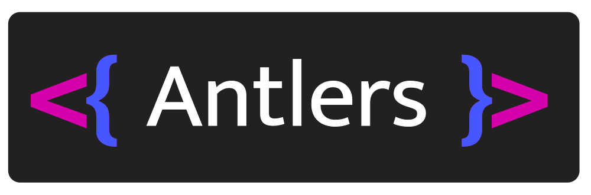
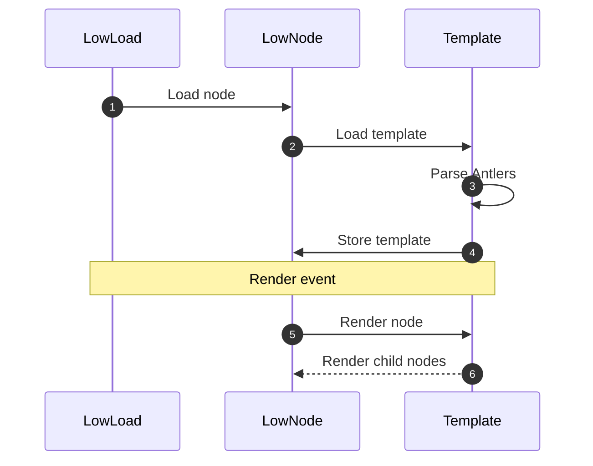

<p align="center"></p>

# Antlers

<a href="https://rubygems.org/gems/antlers" title="Install gem"></a>

Antlers is a templating language designed to be embedded within HTML, where that HTML itself is embedded within a Ruby file. Antlers is used by [LowNode](https://github.com/low-rb/low_node) to render child nodes in a compositional way.

## Syntax

### Variables

Access an instance variable with:
```ruby
def render
  <html>{@user}</html>
end
```
ℹ️ See [Variables API](#api).

### Components

Render a class named `UserNode` with:
```ruby
def render
  <html><{ UserNode }></html>
end
```

ℹ️ The class referenced via `<{ MyClass }>` syntax must implement a `render` method.

**Props:**
```ruby
def render
  <html><{ UserNode user=@user }></html>
end
```

**Slots:**
```ruby
def render
  <html>
    <{ LayoutNode: }>
      <{ UserNode user=@user }>
    <{ :LayoutNode }>
  </html>
end
```

The `LayoutNode` would look like:
```ruby
class LayoutNode
  def render(event:)
    <header>...</header>
    <{ :slot }>
    <footer>...</footer>
  end
end
```

### Conditionals [UNRELEASED]

```ruby
# Block.
<{ if: @user.happy? }>
  <{ UserNode user=@user }>
<{ :if }>

# Directive.
<{ UserNode user=@user if: @user.happy? }>
```

### Loops

```ruby
# Block.
<{ for: user in: @users }>
  <{ UserNode user=user }>
<{ :for }>

# Directive. [UNRELEASED]
<{ UserNode user=user for: user in: @users }>
```

ℹ️ You can iterate a hash with `for: key, value` syntax.

### Forms

Forms can be created in a compositional way, mixing both Antlers syntax with regular form elements:

```ruby
<{ form: '/submit' }>
  <input type="submit" value="Submit">
<{ :form }>
```

Antlers generates additional markup behind the scenes:
- Sets the form's `action` to `/submit`
- Sets the form's `method` to `POST`
- Adds an anti-forgery token to prevent CSRF [UNRELEASED]

Change the `POST` method to `GET` with:

```ruby
<{ form: '/search' method: 'GET' }>
  <input type="search">
  <input type="submit" value="search">
<{ :form }>
```

ℹ️ Antlers provides other input helpers such as `<{ label: 'Label' }>`, `<{ search: :query }>` and `<{ submit: 'Search' }>`. [UNRELEASED]

## Config [UNRELEASED]

### Enabling parallelism

Add parallelism where it makes sense and you can measure the performance outcome and keep data integrity.

**Per sibling:**
```ruby
def render
  # Both child nodes executed at the same time.
  <{ parallelize: }>
    <{ UserNode user=@user }>
    <{ PostsNode posts=@posts }>
  <{ :parallelize }>
end
```

**Per block:**
```ruby
def render
  # Each UserNode rendered at the same time.
  <{ map: user in: @users :parallelize }>
    <{ UserNode user=user }>
  <{ :map }>
end
```

**Per directive:**
```ruby
<{ UserNode user=user for: user in: @users :parallelize }>
```

## Syntax

Antlers uses two different sets of start and stop characters:
- 🦌 **Deerheads:** `<{` and `}>`
- 🖇 **Brackets:** `{` and `}`

Unlike other templating languages which use syntax to distinguish between control flow and output, there is no difference in Antlers. In Antlers all constructs internally render output, even if that output is an empty string (`''`). You can output variables with the Deerhead syntax too (`<{ @instance_var }>` and `<{ local_var }>`). The `{}` brackets syntax is provided in addition for variables as it's shorter and easier to type.

## Advanced Techniques

### Strings

Variables (`{}`) are also useful for embedding text in RBX without any syntax highlighting issues:
```ruby
def render
  <html>{"I'm just a string"}</html>
end
```
ℹ️ **Translations:** Text entered this way can be translated based on region, language or any arbitrary condition. [UNRELEASED]

## Full Examples

### Slot

```ruby
class UserNode < LowNode
  def initialize
    @user = User.new(username: "Random User", bio: "I'm a person!")
  end
  
  def render
    <html>
      <{ LayoutNode: title=@user.username }>
        {@user.bio}
      <{ :LayoutNode }>
    </html>
  end
end
```

The `LayoutNode` would look like:
```ruby
class LayoutNode
  def render(event:, title:)
    <header>...</header>
    <h1>{title}</h1>
    <{ :slot }>
    <footer>...</footer>
  end
end
```

The result would be:
```HTML
<header>...</header>
<h1>Random User</h1>
<p>I'm a person!</p>
<footer>...</footer>
```

## API

### `Antlers.ast(template)`

Parse the Antlers template into an Abstract Syntax Tree.

### `Antlers.render(ast:, current_binding:)`

Render the AST and evaluate variables in the supplied binding.

**Optional arguments:**
- `parent_binding: nil` - For rendering a `<{ :slot }>` in a child component
- `namespace: nil` - The original namespace that the template was defined in

### Variables

Variables `{}` can evaluate the following:
1. An instance variable: `{ @instance_variable }`
2. A method call/local variable: `{ method_or_variable}`
3. A method chain: `{ method_or_variable.method_two }`
4. A static string: `{"Static String"}`

## Architecture

Antlers creates an Abstract Syntax Tree composed of the following `AntlerNode`s:

**Leaf nodes:**
- `PropNode`
- `VarNode`

**Branch nodes:**
- `RootNode`
- `SlotNode`
- `YieldNode` - Renders `AntlerNode`s inside a `SlotNode`

## Integrations

### LowNode



## Philosophy

- **#️⃣ Syntax.** Antlers uses syntax from Ruby to get syntax highlighting out of the box. But it is not Ruby and is designed to limit you to a templating language, with business logic computed in the nodes that render Antlers
- **⏳ Paralellization.** Make paralellization easy by abstracting Ractors and creating immutable data structures on the user's behalf
